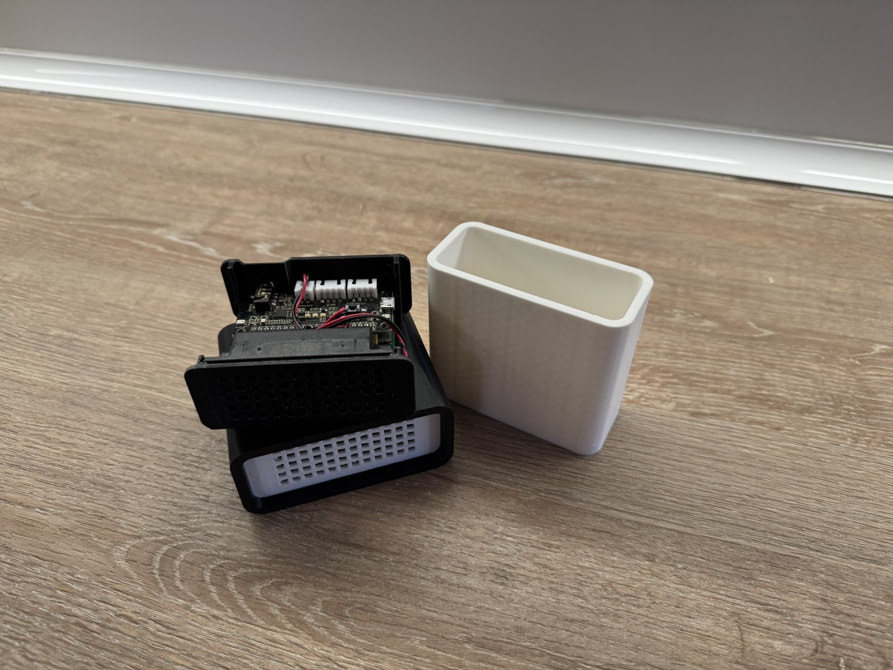

# LVA Buildroot

Buildroot image for Linux Voice Assistant on Raspberry Pi Zero 2 W / Raspberry Pi 3 with a Seeed ReSpeaker 2-Mics Pi HAT (WM8960).



Case in the photo: [Voice Assistant Wyoming Satellite on MakerWorld](https://makerworld.com/en/models/1232745-voice-assistant-wyoming-satellite?from=search#profileId-1251755)

## What this repo actually is

This is a Buildroot external tree plus a Docker-based build wrapper. It builds a small Raspberry Pi image that starts [`linux-voice-assistant`](https://github.com/OHF-Voice/linux-voice-assistant) at boot and exposes it to Home Assistant over the ESPHome native API.

Current target:

| Item | Value |
|---|---|
| Board | Raspberry Pi Zero 2 W, Raspberry Pi 3 / 3B+ |
| Audio HAT | Seeed ReSpeaker 2-Mics Pi HAT, WM8960 |
| Architecture | aarch64 |
| Buildroot config | `buildroot/external/configs/lva_wm8960hat_pi_3_02w_defconfig` |
| Output image | `buildroot/lva-wm8960hat-pi.img.xz` via `make` |
| LVA source | `OHF-Voice/linux-voice-assistant` pinned to `1d84fa089846c689f149048e32963ed61e6d36b5` |

## Status

- Local build path exists and is the most honest way to use this repo right now.
- GitHub Actions exists, but the latest checked runs are failing.
- The last failure was while building `python-aioesphomeapi 45.3.1`: missing build deps `Cython>=3.2.5` and `setuptools>=82.0.1` in the Buildroot Python build environment.
- Hardware boot/audio behaviour has to be verified on the actual Pi + WM8960 HAT before calling this release-ready.
- The image currently has root password `toor`; change it before treating this as anything but a lab image.

## Build locally

Requirements: Docker with amd64 emulation available on Apple Silicon / non-amd64 hosts.

```sh
make
```

That runs the Docker Buildroot build and copies the image to:

```text
buildroot/lva-wm8960hat-pi.img.xz
```

Useful targets:

```sh
make image               # build the Docker builder image
make shell               # enter the Buildroot builder container
make clean-output-cache  # delete the Docker output volume
```

## First boot notes

Wi-Fi autoconfig is included. Put a `wpa_supplicant.conf` file in the boot partition before first boot.

`linux-voice-assistant` is installed as an init script:

```sh
/etc/init.d/S95linux-voice-assistant {start|stop|restart}
```

Logs go to:

```text
/var/log/linux-voice-assistant.log
```

## GitHub Actions

Workflow: `.github/workflows/pi_lva.yml`

It is manual-only:

```yaml
on:
  workflow_dispatch:
```

Checked on 2026-07-04: latest `Build LVA Pi Satellite` runs from 2026-06-24 failed. Keep the workflow, but do not trust it as green until the Python Buildroot dependency issue is fixed.

## What is not done

- No published release image is guaranteed here.
- No automated hardware test exists.
- No claim that every Home Assistant / ESPHome voice feature works.
- No production security hardening.

## Credits

- [`linux-voice-assistant`](https://github.com/OHF-Voice/linux-voice-assistant)
- [`pymicro-wakeword`](https://github.com/OHF-Voice/pymicro-wakeword)
- [`pyopenwakeword`](https://github.com/rhasspy/pyopen-wakeword)
- Buildroot and Raspberry Pi Linux/firmware projects
